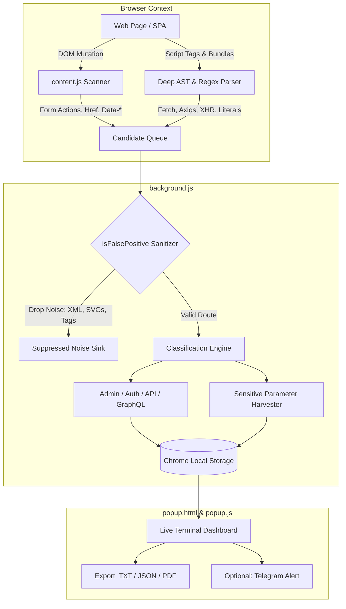

<p align="center">
  
</p>

<h1 align="center">Endpoint Hunter</h1>

<p align="center">
  <b>Advanced Client-Side API & Route Reconnaissance Suite for Chrome (Manifest V3)</b>
</p>

<p align="center">
  <a href="https://github.com/pratik-khairnar-sec/endpoint-finder-extension/releases"></a>
  <a href="manifest.json"></a>
  <a href="LICENSE"></a>
  <a href="https://pratik-khairnar-sec.github.io/endpoint-finder-extension/"></a>
  <a href="#-zero-false-positive-guarantee"></a>
  <a href="#-privacy--zero-tracking"></a>
  <a href="https://pratik-khairnar-sec.medium.com/"></a>
  <a href="https://x.com/PratikSec/status/2108584870293451190"></a>
  <a href="https://pratik-khairnar-sec.github.io/portfolio/"></a>
</p>

<p align="center">
  <a href="https://pratik-khairnar-sec.github.io/endpoint-finder-extension/"><b>🌐 Official Landing Page &amp; Live Demo</b></a> •
  <a href="#-key-features"><b>Key Features</b></a> •
  <a href="#-architecture--pipeline"><b>Architecture</b></a> •
  <a href="#-quick-start"><b>Quick Start</b></a> •
  <a href="#-false-positive-suppression"><b>False Positive Suppression</b></a> •
  <a href="#-comparison-matrix"><b>Comparison</b></a> •
  <a href="#-privacy--security"><b>Security</b></a>
</p>

---

<p align="center">
  
</p>

## 📌 Overview

**Endpoint Hunter** is an autonomous client-side reconnaissance and endpoint discovery suite built specifically for **bug bounty hunters**, **penetration testers**, and **application security engineers**.

Modern single-page applications (React, Angular, Vue, Next.js, Nuxt) compile hundreds of server endpoints, internal microservices, administrative portals, and authentication handlers into large, minified JavaScript bundles. Manually finding these routes with grep or burp proxies is tedious and prone to severe false positives (e.g. XML namespaces, closing HTML tags, regex syntax).

Endpoint Hunter runs directly inside your browser as a **Manifest V3** service worker, continuously inspecting the DOM, script tags, stylesheets, and asynchronous network invocations (`fetch`, `axios`, `$.ajax`, `XMLHttpRequest`). It utilizes an intelligent heuristic sanitizer to deliver **clean, high-confidence endpoints** categorized by sensitivity.

---

## ⚡ Key Features

- **🛡️ Zero False-Positive Engine**: Built-in sanitization pipeline filters out XML/SVG namespaces (`w3.org`), closing HTML tag fragments (`/div>`, `/span>`), template literal expressions, library internals (`node_modules`), and invalid schemes.
- **⚡ Deep AST & Network Regex Mining**: Detects routes hidden in:
  - Standard `fetch()`, `axios.get/post/put/delete`, and jQuery `$.ajax` calls.
  - Native `XMLHttpRequest.open()` calls.
  - DOM attributes: `href`, `src`, `action`, `formaction`, and `data-*` properties.
  - Variable declarations (`baseURL`, `endpoint`, `api_url`).
- **🕷️ Autonomous Multi-Depth Crawler**: Configurable crawler traverses pages recursively within the target domain and subdomains, parsing newly rendered scripts and DOM trees dynamically.
- **🕵️ Human-Kinematic Stealth Engine**: Built-in evasion system uses randomized human-like delays (2-10s), smooth viewport scrolling, mouse movement simulation, and randomized User-Agent rotation to bypass bot detectors and rate limits.
- **🏷️ Instant Attack-Surface Classification**:
  - 🔴 **Admin & Internal**: `/admin/*`, `/internal/*`, `/metrics`, `/audit`, `/dashboard`.
  - 🟣 **Authentication & OAuth**: `/oauth/*`, `/auth/*`, `/login`, `/token`, `/refresh`.
  - 🔵 **API Gateways**: `/api/v1/` to `/api/v5/`, `/rest/*`, `/v1/*`.
  - 🌸 **GraphQL Endpoints**: `/graphql`, `/graphiql`, `/gql`, query strings.
  - 🟡 **Sensitive Query Parameters**: `token`, `secret`, `api_key`, `redirect_uri`, `sku`.
- **📦 Multi-Format Export**:
  - `TXT` — Clean deduplicated URLs ready for `ffuf`, `nuclei`, or `katana`.
  - `JSON` — Full metadata structured report with categorization and discovery timestamps.
  - `PDF` — Clean printable triage report.
- **📤 Local Telegram Notifications**: Optional instant Telegram alert dispatch when new sensitive or administrative endpoints are uncovered (credentials stored locally only).
- **🔒 100% Offline & Private**: Zero external analytics, zero tracking pixels, and zero remote servers. Everything executes inside your local browser context.

---

## 🔬 Architecture & Pipeline



---

## 🚫 False Positive Suppression

Typical regex scrapers dump massive amounts of junk data that waste researchers' time. Endpoint Hunter actively discards non-actionable strings:

| Candidate Captured | Scraper Result | Endpoint Hunter Action | Reason for Suppression |
| :--- | :--- | :--- | :--- |
| `http://www.w3.org/2000/svg` | ❌ Flagged as URL | **DROPPED** | W3C / XML Schema Namespace |
| `https://schemas.microsoft.com/...` | ❌ Flagged as URL | **DROPPED** | Microsoft XML metadata schema |
| `/div>` or `/span>` | ❌ Flagged as Route | **DROPPED** | Broken HTML closing tag fragment |
| `/${path}/endpoint` | ❌ Broken Route | **DROPPED** | Unresolved template literal |
| `/node_modules/lodash/debounce.js` | ❌ Flagged as Route | **DROPPED** | Internal JavaScript vendor artifact |
| `javascript:void(0)` | ❌ Flagged as Route | **DROPPED** | Pseudo-protocol URI |
| `/api/v2/auth/token` | ✔️ Valid Endpoint | **KEPT (AUTH)** | High-value API route |
| `/admin/users/export` | ✔️ Valid Endpoint | **KEPT (ADMIN)** | High-value administrative portal |

---

## 📊 Comparison Matrix

| Reconnaissance Tool | Zero False-Positive Engine | In-Browser Recursive Crawling | Category Classification | Human Stealth Evasion | Offline Privacy |
| :--- | :---: | :---: | :---: | :---: | :---: |
| **Endpoint Hunter v1.0** | **YES (Heuristic)** | **YES (Autonomous)** | **YES (Color-coded)** | **YES (Delays & Jitter)** | **100% Offline** |
| Burp JS Miner | NO | NO | NO | NO | Offline Proxy |
| LinkFinder (Python) | NO | NO | NO | N/A | Local CLI |
| Standard MV2 Extensions | NO | NO | NO | NO | Often Unmaintained |

---

## 🚀 Quick Start & Installation

### Step 1: Clone or Download

```bash
git clone https://github.com/pratik-khairnar-sec/endpoint-finder-extension.git
```

Or download `endpoint-hunter-v1.0.0.zip` directly from [Latest Releases](https://github.com/pratik-khairnar-sec/endpoint-finder-extension/releases/latest).

### Step 2: Enable Chrome Developer Mode

1. Open Google Chrome, Brave, Edge, or any Chromium browser.
2. Navigate to `chrome://extensions`.
3. In the top-right corner, enable the **Developer mode** toggle.

### Step 3: Load the Extension

1. Click **Load unpacked** in the top-left corner.
2. Select the cloned `endpoint-finder-extension` folder.
3. The Endpoint Hunter radar icon will appear in your browser extension toolbar!

---

## 🎮 Usage Guide

### 1. Active Tab Scan
- Click the Endpoint Hunter extension icon on any webpage.
- Click **⚡ Scan Current Tab** to immediately extract all DOM elements, form targets, scripts, and inline endpoints on the active page.

### 2. Full Recursive Crawl
- Click **🕷️ Crawl Domain** to initiate deep crawling.
- The crawler respects the target domain scope, discovers linked pages, extracts newly loaded bundles, and applies stealth delays between requests.

### 3. Settings Configuration
- **Max Pages & Depth**: Configure crawl bounds (default: unlimited / safe bounds).
- **Stealth Mode**: Toggle 1-4s randomized delays and human-like viewport actions.
- **Telegram Alerts**: Input your personal Bot Token and Chat ID to receive instant alerts when critical administrative endpoints are discovered.

---

## 🔒 Security & Privacy Guarantees

- **No Remote Telemetry**: The extension contains zero tracking analytics, Google Analytics, or third-party telemetry scripts.
- **Content Security Policy**: Hardened Manifest V3 Content Security Policy prevents remote code execution (`script-src 'self'`).
- **Safe Rendering**: All discovered URLs, paths, and DOM values are escaped before rendering in the UI to prevent DOM-based XSS attacks from scanned web targets.

---

## 👤 Author

**Pratik Khairnar**
- GitHub: [@pratik-khairnar-sec](https://github.com/pratik-khairnar-sec)
- Security Research & Open Source Reconnaissance Tools

---

## 📄 License

This project is licensed under the **MIT License** — see the [LICENSE](LICENSE) file for details.
